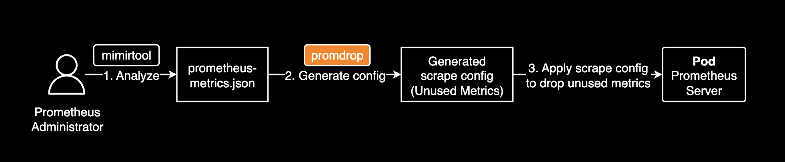
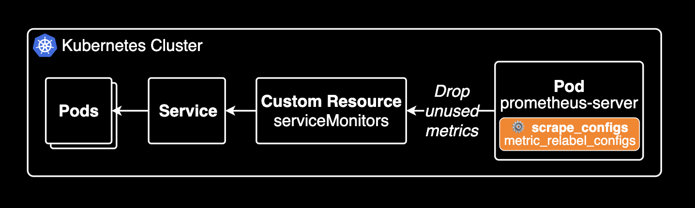

[](https://github.com/younsl/promdrop/releases)
[](https://github.com/users/younsl/packages/container/package/promdrop)
[](https://golang.org/)
[](https://opensource.org/licenses/MIT)

# Promdrop

A Go CLI tool to generate Prometheus `metric_relabel_configs` for dropping unused metrics.

promdrop parses the `additional_metric_counts` section from a `prometheus-metrics.json` file and creates YAML configurations to filter out these metrics per job.

## Background

### Why Promdrop?

Managing Prometheus metrics at scale can be challenging, especially for Site Reliability Engineers (SREs), DevOps Engineers, and other Observability practitioners. Over time, environments accumulate unused metrics, consuming resources and potentially impacting performance. Identifying these metrics and manually crafting `metric_relabel_configs` to drop them for each job is tedious and error-prone.

`Promdrop` was created to simplify this process for those managing observability platforms. By analyzing metric usage data (like that produced by `mimirtool analyze prometheus`), it automatically generates the necessary `scrape_configs` with `metric_relabel_configs` to efficiently drop unused metrics. This helps streamline Prometheus configuration management and optimize the operational environment.

## Installation

Build promdrop binary file from source code:

```bash
# Navigate to the project root (younsl/promdrop)
make build
```

This command will create a `promdrop` binary file in your current directory.

## Usage

### Prerequisite

- **Analyze your Prometheus metrics**: Analyze your Prometheus metrics using the [Grafana Mimirtool](https://grafana.com/docs/mimir/latest/manage/tools/mimirtool/) to recognize unused metrics for each job. Refer to [this article by David Calvert](https://0xdc.me/blog/how-to-find-unused-prometheus-metrics-using-mimirtool/) for guidance on using mimirtool.

> [!IMPORTANT]
> **This step is crucial.** `promdrop` relies entirely on the analysis results within the `prometheus-metrics.json` file generated by `mimirtool analyze prometheus`. Without a properly generated input file reflecting your environment's metric usage, `promdrop` cannot function and will produce no meaningful outputs.



### Usage

```bash
./promdrop --help
./promdrop --file <prometheus-metrics.json> [flags]
```

**Flags:**

- `-f`, `--file <string>`: (Required) Input `prometheus-metrics.json` file path.
- `-t`, `--txt-output-dir <string>`: Output directory for per-job `.txt` metric lists (default: `unused`).
- `-o`, `--output <string>`: Output file for combined YAML configuration (default: `combined_relabel_configs.yaml`).
- `-h`, `--help`: Show help message.

**Example:**

```bash
./promdrop --file prometheus-metrics.json --output combined_relabel_configs.yaml
```

## Output

promdrop generates two main parts of output files:

### 1. Prometheus Scrape Configuration (YAML)

**`combined_relabel_configs.yaml` (or specified by `-o`):** Contains a list of job configurations with `metric_relabel_configs` to drop unused metrics. The relevant `metric_relabel_configs` sections for each job should be integrated into the corresponding job definitions within your Prometheus `scrape_configs`. If you are using the Prometheus Community Helm chart, this typically involves adding these configurations under the `prometheus.prometheusSpec.scrapeConfigs` section in your Helm chart values file.

If you are using kube-prometheus-stack, you can add auto-generated scrape configs to your `values_my_dev.yaml` file to drop unused metrics.

```yaml
# charts/kube-prometheus-stack/values_my_dev.yaml
prometheus:
  prometheusSpec:
    additionalScrapeConfigs:
      # Add auto-generated scrape configs from promdrop
      # Summary: 75 of 1234 unused metrics / 5 prefix groups / 6 rules generated
      - job_name: coredns
        kubernetes_sd_configs:
          - role: service
        relabel_configs:
          - source_labels: [__meta_kubernetes_namespace]
            regex: kube-system
            action: keep
          - source_labels: [__meta_kubernetes_service_name]
            regex: 'kube-dns|kube-prometheus-stack-coredns'
            action: keep
        metric_relabel_configs:
          - source_labels: [__name__]
            regex: 'coredns_build_info|coredns_cache_requests_total|coredns_dns_request_duration_seconds_count|coredns_dns_request_duration_seconds_sum|coredns_dns_request_size_bytes_count|coredns_dns_request_size_bytes_sum|coredns_dns_response_size_bytes_count|coredns_dns_response_size_bytes_sum|coredns_forward_healthcheck_broken_total|coredns_forward_max_concurrent_rejects_total|coredns_health_request_duration_seconds_bucket|coredns_health_request_duration_seconds_count|coredns_health_request_duration_seconds_sum|coredns_health_request_failures_total|coredns_hosts_reload_timestamp_seconds|coredns_kubernetes_dns_programming_duration_seconds_bucket|coredns_kubernetes_dns_programming_duration_seconds_count|coredns_kubernetes_dns_programming_duration_seconds_sum|coredns_kubernetes_rest_client_rate_limiter_duration_seconds_bucket|coredns_kubernetes_rest_client_rate_limiter_duration_seconds_count|coredns_kubernetes_rest_client_rate_limiter_duration_seconds_sum'
            action: drop
          - source_labels: [__name__]
            regex: 'coredns_kubernetes_rest_client_request_duration_seconds_bucket|coredns_kubernetes_rest_client_request_duration_seconds_count|coredns_kubernetes_rest_client_request_duration_seconds_sum|coredns_kubernetes_rest_client_requests_total|coredns_local_localhost_requests_total|coredns_panics_total|coredns_plugin_enabled|coredns_proxy_conn_cache_hits_total|coredns_proxy_conn_cache_misses_total|coredns_proxy_request_duration_seconds_bucket|coredns_proxy_request_duration_seconds_count|coredns_proxy_request_duration_seconds_sum|coredns_reload_failed_total'
            action: drop
          - source_labels: [__name__]
            regex: 'go_gc_duration_seconds|go_gc_duration_seconds_count|go_gc_duration_seconds_sum|go_gc_gogc_percent|go_gc_gomemlimit_bytes|go_info|go_memstats_alloc_bytes|go_memstats_alloc_bytes_total|go_memstats_buck_hash_sys_bytes|go_memstats_frees_total|go_memstats_gc_sys_bytes|go_memstats_heap_alloc_bytes|go_memstats_heap_idle_bytes|go_memstats_heap_inuse_bytes|go_memstats_heap_objects|go_memstats_heap_released_bytes|go_memstats_heap_sys_bytes|go_memstats_last_gc_time_seconds|go_memstats_mallocs_total|go_memstats_mcache_inuse_bytes|go_memstats_mcache_sys_bytes|go_memstats_mspan_inuse_bytes|go_memstats_mspan_sys_bytes|go_memstats_next_gc_bytes|go_memstats_other_sys_bytes|go_memstats_stack_inuse_bytes|go_memstats_stack_sys_bytes|go_memstats_sys_bytes|go_sched_gomaxprocs_threads|go_threads'
            action: drop
          - source_labels: [__name__]
            regex: 'count:up1'
            action: drop
          - source_labels: [__name__]
            regex: 'process_max_fds|process_network_receive_bytes_total|process_network_transmit_bytes_total|process_open_fds|process_virtual_memory_bytes|process_virtual_memory_max_bytes'
            action: drop
          - source_labels: [__name__]
            regex: 'scrape_duration_seconds|scrape_samples_post_metric_relabeling|scrape_samples_scraped|scrape_series_added'
            action: drop
```

> [!NOTE]
> A current limitation is that [kubernetes_sd_configs](https://prometheus.io/docs/prometheus/latest/configuration/configuration/#kubernetes_sd_config) and [relabel_configs](https://grafana.com/blog/2022/03/21/how-relabeling-in-prometheus-works/) are not included in the generated output. You will need to manually add the appropriate service discovery configuration to each job definition when integrating these relabel rules.

This diagram illustrates how the generated configuration drops metrics in a Kubernetes environment using the `kube-prometheus-stack`/`ServiceMonitor` pattern:



### 2. Unused Metric Lists & Summary (Text)

- **`<txt-output-dir>/unused_metrics_<job_name>.txt`:** Lists the specific unused metric names for each job found in the input file.
- **`<txt-output-dir>/summary.txt`:** Provides a summary table of unused metric counts per job, based on the job names present in the `prometheus-metrics.json` file.

```bash
# summary.txt
SOURCE FILE              JOB NAME   METRIC COUNT  
prometheus-metrics.json  apiserver  390           
prometheus-metrics.json  coredns    75  
```

## License

This project is licensed under the MIT License. See the [LICENSE](LICENSE) file for details.
